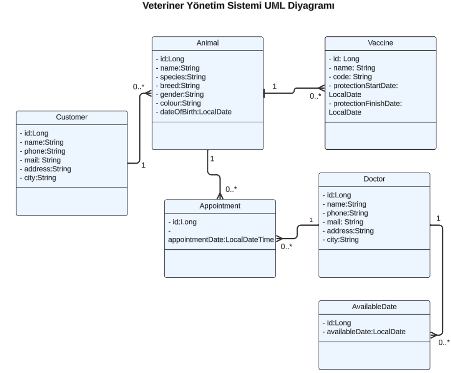

# Veteriner Yönetim Sistemi 
- Veteriner Yönetim Sistemi, veteriner kliniklerinin günlük işlerini düzenlemek ve yönetmek amacıyla oluşturulmuş bir REST API'dir. Bu API ile veteriner çalışanının veteriner doktorları, müşterileri, hayvanları ve aşılarını, randevuları yönetmesi sağlanır.

# Veterinary Management System
- Veterinary Management System is a REST API created to organize and manage the daily affairs of veterinary clinics. With this API, the veterinary worker is enabled to manage veterinarians, customers, animals and their vaccinations, and appointments.

# Kullanılan Teknolojiler / Used Technologies
- Java                     
- Spring Boot 
- PostgresSQL
- Swagger

# Özellikler 
- Veteriner Doktorları Yönetimi: Veteriner doktorları ekleyebilme, güncelleyebilme, görüntüleyebilme ve silebilme yeteneği.
- Müşteri Yönetimi: Müşterileri kaydedebilme, bilgilerini güncelleyebilme, listeleme ve silme yeteneği.
- Hayvan Yönetimi: Hayvanları sisteme kaydedebilme, bilgilerini güncelleyebilme, listeleme ve silme yeteneği.
- Aşı Yönetimi: Hayvanlara uygulanan aşıları kaydedebilme, bilgilerini güncelleyebilme, listeleme ve silme yeteneği.
- Randevu Yönetimi: Veteriner doktorları için randevular oluşturabilme, güncelleyebilme, görüntüleyebilme ve silebilme yeteneği.
- Çeşitli filtreleme yetenekleri

# Features
- Veterinarians Management: Ability to add, update, view and delete veterinarians.
- Customer Management: Ability to register customers, update their information, list and delete them.
- Animal Management: Ability to register animals in the system, update their information, list and delete them.
- Vaccine Management: Ability to record, update, list and delete vaccinations applied to animals.
- Appointment Management: Ability to create, update, view and delete appointments for veterinarians.
- Various filtering capabilities

# UML Diyagram / UML Diagram

# API Kullanımı / API Usage

Aşağıda, API'nin sunduğu temel endpoint'lerin bir listesi bulunmaktadır:

Below is a list of the main endpoints the API offers:

| Endpoint                                    | HTTP Metodu | Açıklama                                                                           |
|---------------------------------------------|:------------|------------------------------------------------------------------------------------|
| **customers**                               |             |                                                                                    |
| `/api/v1/customers/{id}`                    | GET         | Belirtilen ID'ye sahip hayvan sahibini getirir                                     |
| `/api/v1/customers/{id}`                    | PUT         | Belirtilen ID'ye sahip hayvan sahibini günceller                                   |
| `/api/v1/customers/{id}`                    | DELETE      | Belirtilen ID'ye sahip hayvan sahibini siler                                       |
| `/api/v1/customers`                         | GET         | Tüm hayvan sahiplerini getirir                                                     |
| `/api/v1/customers`                         | POST        | Hayvan sahibi ekler                                                                |
| `/api/v1/customers/searchByName`            | GET         | İsme gore hayvan sahiplerini getirir                                               |
|                                             |             |                                                                                    |
| **animals**                                 |             |                                                                                    |
| `/api/v1/animals/{id}`                      | GET         | Belirtilen ID'ye sahip hayvanı getirir                                             |
| `/api/v1/animals/{id}`                      | PUT         | Belirtilen ID'ye sahip hayvanı günceller                                           |
| `/api/v1/animals/{id}`                      | DELETE      | Belirtilen ID'ye sahip hayvanı siler                                               |
| `/api/v1/animals`                           | GET         | Tüm hayvanları getirir                                                             |
| `/api/v1/animals`                           | POST        | Hayvan ekler                                                                       |
| `/api/v1/animals/searchByName`              | GET         | İsme göre hayvanları filtreler                                                     |
| `/api/v1/animals/searchByCustomer`          | GET         | Hayvan sahiplerine göre hayvanları filtreler                                       |
|                                             |                                    |             |                                                                                    |
| **vaccines**                                |             |                                                                                    |
| `/api/v1/vaccines/{id}`                     | GET         | Belirtilen ID'ye sahip aşıyı getirir                                               |
| `/api/v1/vaccines/{id}`                     | PUT         | Belirtilen ID'ye sahip aşıyı günceller                                             |
| `/api/v1/vaccines/{id}`                     | DELETE      | Belirtilen ID'ye sahip aşıyı siler                                                 |
| `/api/v1/vaccines`                          | GET         | Tum aşıları getirir                                                                |
| `/api/v1/vaccines`                          | POST        | Aşı ekler                                                                          |
| `/api/v1/vaccines/searchByVaccinationRange` | GET         | Girilen tarih araligina gore aşı kayıtlarını getirir                               |
| `/api/v1/vaccines/searchByAnimal`           | GET         | Belirli bir hayvana ait tüm aşı kayıtlarını getirir                                |
|                                             |             |                                                                                    |
| **doctors**                                 |             |                                                                                    |
| `/api/v1/doctors/{id}`                      | GET         | Belirtilen ID'ye sahip doktoru getirir                                             |
| `/api/v1/doctors/{id}`                      | PUT         | Belirtilen ID'ye sahip doktoru günceller                                           |
| `/api/v1/doctors/{id}`                      | DELETE      | Belirtilen ID'ye sahip doktoru siler                                               |
| `/api/v1/doctors`                           | GET         | Tum doktorlari getirir                                                             |
| `/api/v1/doctors`                           | POST        | Doktor ekler                                                                       |
|                                             |             |                                                                                    |
| **available_dates**                         |             |                                                                                    |
| `/api/v1/available_dates/{id}`              | GET         | Belirtilen ID'ye sahip müsait günü getirir                                         |
| `/api/v1/available_dates/{id}`              | PUT         | Belirtilen ID'ye sahip müsait günü günceller                                       |
| `/api/v1/available_dates/{id}`              | DELETE      | Belirtilen ID'ye sahip müsait günü siler                                           |
| `/api/v1/available_dates`                   | GET         | Tüm müsait günü getirir                                                            |
| `/api/v1/available_dates`                   | POST        | Müsait gün ekler                                                                   |
|                                             |             |                                                                                    |
| **appointments**                            |             |                                                                                    |
| `/api/v1/appointments/{id}`                 | GET         | Belirtilen ID'ye sahip randevuyu getirir                                           |
| `/api/v1/appointments/{id}`                 | PUT         | Belirtilen ID'ye sahip randevuyu günceller                                         |
| `/api/v1/appointments/{id}`                 | DELETE      | Belirtilen ID'ye sahip randevuyu siler                                             |
| `/api/v1/appointments`                      | GET         | Tüm randevulari getirir                                                            |
| `/api/v1/appointments`                      | POST        | Randevu ekler                                                                      |
| `/api/v1/appointments/searchByDoctorAndDateRange`             | GET         | Kullanıcı tarafından girilen tarih aralığına ve doktora göre randevuları filtreler |
| `/api/v1/appointments/searchByAnimalAndDateRange`             | GET         | Kullanıcı tarafından girilen tarih aralığına ve hayvana göre randevuları filtreler |
